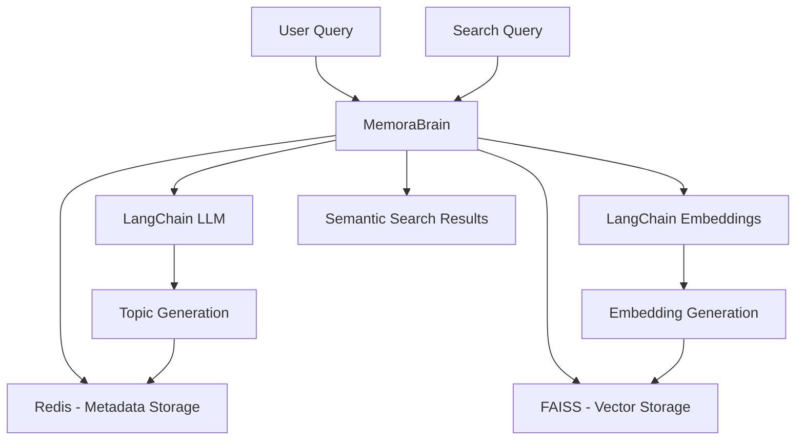

# Memora - LLM Memory System 🧠

> A sophisticated conversation memory system for Large Language Models using Redis, FAISS, and Google Generative AI.

---

## 📋 Table of Contents

- [Overview](#overview)
- [Architecture](#architecture)
- [Prerequisites](#prerequisites)
- [Installation](#installation)
- [How to Run](#how-to-run)
- [Project Structure](#project-structure)
- [Code Files Detailed Documentation](#code-files-detailed-documentation)
- [API Reference](#api-reference)
- [Example Usage](#example-usage)

---

## Overview

**Memora** is a memory management system designed for LLM-based chatbots. It provides:

- **Persistent conversation storage** using Redis as an in-memory database
- **Semantic search** using FAISS vector database with Google's embedding models
- **Automatic topic classification** using Google Generative AI
- **Thread-based conversation management** to organize multiple conversation sessions
- **Referral tracking** to link related conversation contexts

### Key Features

| Feature | Description |
|---------|-------------|
| 🧵 Thread Management | Create and manage separate conversation threads |
| 📝 Conversation Windows | Store Q&A pairs with metadata (topics, timestamps, users) |
| 🔍 Semantic Search | Find relevant past conversations using vector similarity |
| 🏷️ Auto Topic Generation | Automatically classify conversations into topics |
| 💾 Vector Storage | FAISS-based vector DB for efficient similarity search |

---

## Architecture



### Components

1. **Redis**: Stores conversation metadata, thread information, and topic indices
2. **FAISS**: Stores vector embeddings for semantic search
3. **Google Generative AI**: Powers both LLM (topic classification) and embeddings
4. **LangChain**: Provides unified interface to AI models

---

## Prerequisites

Before running Memora, ensure you have:

1. **Python 3.10+** installed
2. **Redis Server** running locally on port 6379
3. **Google API Key** for Generative AI services

### Installing Redis on Windows

```powershell
# Option 1: Use WSL (Windows Subsystem for Linux)
wsl --install
# Then in WSL:
sudo apt update
sudo apt install redis-server
sudo service redis-server start

# Option 2: Docker
docker run -d -p 6379:6379 redis:latest

# Option 3: Use Memurai (Redis-compatible for Windows)
# Download from: https://www.memurai.com/
```

To verify Redis is running:
```powershell
redis-cli ping
# Should return: PONG
```

---

## Installation

### 1. Navigate to the project folder
```powershell
cd c:\Users\visha\Desktop\Memora\Memora
```

### 2. Activate the virtual environment
```powershell
# The virtual environment 'memo' has already been created
.\memo\Scripts\Activate.ps1
```

### 3. Verify dependencies are installed
```powershell
pip list
```

Required packages include:
- `redis>=4.5.0` - Redis client
- `faiss-cpu>=1.7.0` - Vector database
- `numpy>=1.24.0` - Numerical operations
- `python-dotenv>=1.0.0` - Environment variable management
- `google-generativeai>=0.3.0` - Google AI SDK
- `sentence-transformers>=2.2.2` - Transformer models
- `pydantic` - Data validation
- `langchain-google-genai` - LangChain Google integration

### 4. Set up your API Key

Edit the `.env` file and add your Google API key:
```
GOOGLE_API_KEY=your_google_api_key_here
```

---

## How to Run

### Option 1: Run the Test Script (Recommended for first-time users)

```powershell
# Activate the virtual environment
.\memo\Scripts\Activate.ps1

# Make sure Redis is running first!
# Then run the test script
python kavya_test.py
```

This script:
- Creates a new conversation thread
- Adds sample Q&A data
- Tests the search functionality
- Allows interactive search queries

### Option 2: Run Individual Test Files

```powershell
# For testing conversation window creation
python latest_check.py

# For testing thread management
python me_check.py
```

> [!IMPORTANT]
> **Redis must be running** before executing any of these scripts. The application will fail to connect if Redis is not available on `localhost:6379`.

---

## Project Structure

```
Memora/
├── .env                      # Environment variables (API keys)
├── requirements.txt          # Python dependencies
├── memory_system.py          # 🧠 Core MemoraBrain class (MAIN FILE)
├── chatbot_with_memory.py    # Chatbot implementation with memory
├── demo.py                   # Demo script (uses older API)
├── kavya_test.py             # Test script with search functionality
├── latest_check.py           # Quick test for conversation windows
├── me_check.py               # Test script for topic generation
├── s.txt                     # Notes/scratch file
├── dump.rdb                  # Redis dump file
├── helper/                   # Helper modules
│   ├── embedding_helper.py   # Embedding utilities
│   └── langchain_block.py    # LangChain configuration
├── vecdb_storage/            # FAISS vector database storage
│   └── Thread_*/             # Per-thread vector indices
│       ├── index.faiss       # FAISS index file
│       └── metadata.json     # Vector metadata
└── memo/                     # Virtual environment (created)
```

---

## Code Files Detailed Documentation

### 1. `memory_system.py` - The Core Engine

**Purpose**: Main `MemoraBrain` class that handles all memory operations.

**Lines of Code**: ~936

**Key Classes**:

```python
class GenerateTopics(BaseModel):
    """Pydantic model for structured topic output from LLM"""
    topics_list: list[str]

class MemoraBrain:
    """Main memory management class"""
```

**Key Methods**:

| Method | Description |
|--------|-------------|
| `__init__()` | Initialize Redis client, LLM, embedding model, and vector DB path |
| `createThread()` | Create a new conversation thread and return its ID |
| `createConversationWindow()` | Store a Q&A pair with embedding, topics, and metadata |
| `getThreadTopics()` | Retrieve all topics associated with a thread |
| `getThreadDetails()` | Get all metadata for a thread |
| `generateEmbeddingsViaLangchain()` | Generate embeddings using the configured model |
| `generateOrMatchTopicsViaLangchain()` | Classify conversation into topics using LLM |
| `search_by_question()` | Semantic search for relevant conversations |
| `search_by_text()` | Text-based search in stored conversations |
| `create_vecdb_if_needed()` | Initialize FAISS index for a thread |
| `insert_into_vecdb()` | Add embedding to FAISS index |

**Initialization Example**:
```python
from memory_system import MemoraBrain
from langchain_google_genai import ChatGoogleGenerativeAI, GoogleGenerativeAIEmbeddings

llm = ChatGoogleGenerativeAI(model="gemini-2.0-flash", temperature=0)
embedding_model = GoogleGenerativeAIEmbeddings(model="models/gemini-embedding-exp-03-07")

brain = MemoraBrain(
    langchain_llm=llm,
    langchain_embedding_model=embedding_model,
    host='localhost',
    port=6379,
    db=0,
    vecdb_base_path="vecdb_storage"
)
```

---

### 2. `chatbot_with_memory.py` - Chatbot Implementation

**Purpose**: A higher-level chatbot interface that uses `MemoraBrain` for memory.

**Lines of Code**: 167

> [!WARNING]
> This file uses an older API (`MemoraBrain` without LLM initialization). It needs updating to work with the current `memory_system.py`.

**Key Class**:

```python
class MemoraChatbot:
    """Chatbot that maintains conversation context using MemoraBrain"""
```

**Key Methods**:

| Method | Description |
|--------|-------------|
| `__init__(username)` | Initialize chatbot with username |
| `start_new_conversation()` | Begin a new conversation thread |
| `continue_conversation(thread_id)` | Resume an existing thread |
| `process_query(query, mock_llm_response)` | Process a query with memory integration |
| `get_conversation_history()` | Retrieve full conversation history |

**Contains**: Interactive demo with mock LLM responses for testing.

---

### 3. `demo.py` - Demo Script

**Purpose**: Demonstrates basic memory system operations.

**Lines of Code**: 97

> [!WARNING]
> Uses older API methods like `search_by_text()`, `search_by_user()`, `semantic_search()` that may be commented out in the current `memory_system.py`.

**Demonstrates**:
- Creating conversation windows
- Searching by text
- Searching by user
- Semantic search
- Thread exploration

---

### 4. `kavya_test.py` - Interactive Test Script ⭐

**Purpose**: Comprehensive test script for the `search_by_question` functionality.

**Lines of Code**: 155

**What it does**:
1. Initializes MemoraBrain with Google AI models
2. Creates a new thread
3. Adds 5 sample Q&A conversations
4. Tests search with exact queries
5. Provides interactive search mode

**Sample Data Topics**:
- Artificial Intelligence
- Blockchain Technology
- Philosophy (Meaning of Life)
- Meditation Benefits
- Geography (Capital of France)

**Usage**:
```powershell
.\memo\Scripts\Activate.ps1
python kavya_test.py
```

---

### 5. `latest_check.py` - Quick Test

**Purpose**: Quick test for adding a conversation window to an existing thread.

**Lines of Code**: 34

**Note**: Uses a hardcoded `thread_id`. You may need to update this with a valid thread ID from your Redis instance.

---

### 6. `me_check.py` - Topic Generation Test

**Purpose**: Test script for topic generation and conversation window creation.

**Lines of Code**: 178

**Sample Data**: Contains example conversations about:
- Virat Kohli (Cricket)
- Biryani recipe (Food/Cooking)

---

### 7. `helper/embedding_helper.py` - Embedding Utilities

**Purpose**: Helper for testing different embedding models.

**Lines of Code**: 86

**Contains**:
- Examples using Hugging Face Inference API (commented out)
- Google Generative AI embeddings setup
- Multiple embedding model configurations

---

### 8. `helper/langchain_block.py` - LangChain Configuration

**Purpose**: Standalone topic generation using LangChain.

**Lines of Code**: 71

**Key Function**:
```python
def getTopicsList(llm, question, answer):
    """Generate topic list from a Q&A pair using LLM structured output"""
```

**Contains example**: Topic generation for a conversation about Virat Kohli.

---

## API Reference

### Creating a Thread

```python
thread_id = brain.createThread()
# Returns: "Thread_<uuid>"
```

### Storing a Conversation

```python
result = brain.createConversationWindow(
    query_text="What is machine learning?",
    answer_text="Machine learning is a subset of AI...",
    thread_id=thread_id,
    user_name="John",              # Optional
    referral_ids=None,             # Optional: list of related window IDs
    generate_topics=True           # Optional: auto-generate topics
)
# Returns: {window_id, thread_id, vector_id, topics}
```

### Searching Conversations

```python
# Semantic search by question
results = brain.search_by_question(
    question_text="How does AI learn?",
    thread_id=thread_id,
    top_k=5
)

# Text search
results = brain.search_by_text("machine learning", limit=10)
```

### Getting Thread Information

```python
# Get all topics in a thread
topics = brain.getThreadTopics(thread_id)

# Get full thread details
details = brain.getThreadDetails(thread_id)
```

---

## Example Usage

### Complete Workflow

```python
import os
from dotenv import load_dotenv
from memory_system import MemoraBrain
from langchain_google_genai import ChatGoogleGenerativeAI, GoogleGenerativeAIEmbeddings

# Load environment variables
load_dotenv()

# Initialize models
llm = ChatGoogleGenerativeAI(model="gemini-2.0-flash", temperature=0)
embedding_model = GoogleGenerativeAIEmbeddings(model="models/gemini-embedding-exp-03-07")

# Initialize MemoraBrain
brain = MemoraBrain(
    langchain_llm=llm,
    langchain_embedding_model=embedding_model,
    host='localhost',
    port=6379,
    vecdb_base_path="vecdb_storage"
)

# Create a new thread
thread_id = brain.createThread()
print(f"Created thread: {thread_id}")

# Add a conversation
result = brain.createConversationWindow(
    query_text="What is Python?",
    answer_text="Python is a high-level programming language known for its simplicity.",
    thread_id=thread_id,
    user_name="Alice"
)
print(f"Created window: {result['window_id']}, Topics: {result['topics']}")

# Search for similar conversations
search_results = brain.search_by_question(
    question_text="Tell me about programming languages",
    thread_id=thread_id,
    top_k=3
)

for r in search_results:
    print(f"Q: {r['question']}")
    print(f"A: {r['answer']}")
    print(f"Similarity: {r['similarity_score']:.4f}")
```

---

## Troubleshooting

### Common Issues

| Issue | Solution |
|-------|----------|
| `redis.exceptions.ConnectionError` | Start Redis server: `redis-server` or Docker |
| `GOOGLE_API_KEY not found` | Add API key to `.env` file |
| `Different Embedding model's used` | Use consistent embedding model for a thread |
| `Index or metadata file missing` | The thread's vector DB wasn't initialized |

### Validating Setup

```powershell
# Check Redis is running
redis-cli ping  # Should return PONG

# Check Python environment
.\memo\Scripts\Activate.ps1
python -c "import redis; r = redis.Redis(); print(r.ping())"  # Should return True
```

---

## Summary

**Memora** is a powerful LLM memory system that:
- Stores conversations with automatic topic classification
- Enables semantic search across conversation history
- Organizes conversations into threads
- Uses state-of-the-art embeddings for similarity matching

**To get started**:
1. Start Redis server
2. Activate the `memo` virtual environment
3. Run `python kavya_test.py` for an interactive demo

---

*Documentation generated for Memora Project*
